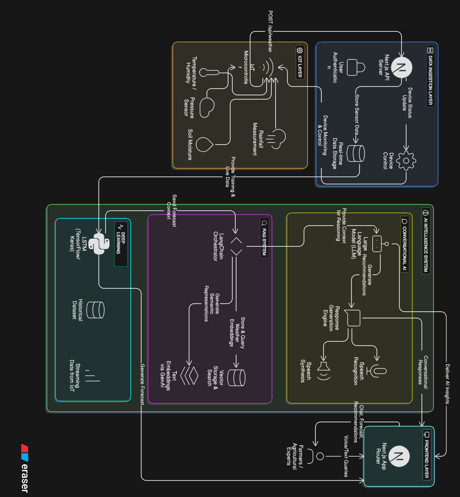

# KLIMA - Knowledge-base Local Intelligence for Microweather Analysis


KLIMA is an advanced AI-powered microweather intelligence platform that fuses **Deep Learning (LSTM)**, **RAG (Retrieval-Augmented Generation)**, and **IoT sensor networks** to deliver hyperlocal weather predictions and actionable farming insights for modern agriculture.

## 🚀 Innovative Features

### 🧠 Deep Learning Weather Prediction

* **LSTM neural networks** trained using extensive Philippine weather datasets
* **4-day hyperlocal forecasting** with high accuracy
* **Historical pattern recognition** across multiple regions
* **Adaptive model refinement** using real-time IoT sensor data

### 🔍 RAG-Powered Intelligence

* **Pinecone vector database** for weather embeddings
* **Semantic search** to retrieve the most relevant climate context
* **Google Generative AI embeddings** for enhanced text understanding
* **Context-aware recommendations** based on similar historical conditions

### 🗣️ Conversational AI Interface

* **NLP capabilities** via Google Gemini API
* **Voice and text interaction** with seamless TTS and STT
* **Weather-aware conversations** tailored to your farm
* **Personalized farming advice** based on current conditions

### 🌐 IoT Sensor Integration

* **Real-time environmental monitoring** via NodeMCU ESP8266
* Multi-parameter tracking:

  * Temperature
  * Humidity
  * Pressure
  * Soil Moisture
  * Rainfall
* **Automated data upload** to Firebase
* **Device health and status monitoring**

## 🏗️ Architecture Overview

KLIMA merges **IoT hardware**, **AI models**, and a **RAG pipeline** to produce intelligent and hyperlocal weather insights.

<p align="center">
  
</p>
_Figure 1. KLIMA's end-to-end architecture connecting IoT devices, AI pipelines, and user interfaces._

## 🛠️ Technology Stack

### Frontend

* **Next.js 14** (App Router)
* **TypeScript**
* **Tailwind CSS**
* **ShadCN UI**
* **GSAP** for animations
* **Recharts** for visualization

### Backend & AI

* **Firebase Realtime Database**
* **Firebase Authentication**
* **Google Gemini API**
* **Pinecone Vector DB**
* **LangChain** workflow orchestration
* **Google Generative AI Embeddings**

### IoT & Hardware

* **NodeMCU ESP8266**
* **DHT22** (Temperature/Humidity)
* **BMP280** (Pressure)
* **Capacitive Soil Moisture Sensor**
* **Rain Gauge**

### Machine Learning

* **TensorFlow / Keras**
* **LSTM sequential models**
* **Python** for training and preprocessing
* **Philippine historical weather data**

## 📊 API Endpoints

### Weather Data Submission

```http
POST /api/weather?deviceId={id}
Content-Type: application/json

{
  "weather": [
    {
      "temp": 27.3,
      "humidity": 82.4,
      "pressure": 1010.36,
      "soilMoisture": 72.71,
      "rainfall": 0.005
    }
  ]
}
```

### AI-Powered Recommendations

```http
POST /api/recommend
Content-Type: application/json

{
  "weather": [...],
  "deviceId": "device-123"
}

Response:
[
  {
    "title": "Irrigate Your Crops",
    "description": "Temperature is high and humidity low. Schedule irrigation to maintain soil moisture."
  }
]
```

### Conversational Chat Interface

```http
POST /api/chat
Content-Type: application/json

{
  "deviceId": "device-123",
  "message": "Should I water my crops today?",
  "weather": [...],
  "farm": {
    "farmLocation": "Tagum City, PH",
    "crops": ["Rice", "Tomatoes"],
    "irrigationSystem": "Surface Irrigation"
  }
}
```

## 🚀 Getting Started

### Prerequisites

* Node.js 18+
* Firebase Project
* Google Cloud API Key (Gemini)
* Pinecone API Key
* NodeMCU ESP8266 with sensors

### Installation

1. **Clone the repository**

```bash
git clone https://github.com/whilmarbitoco/klima.git
cd klima-web
```

2. **Install dependencies**

```bash
npm install
```

3. **Environment Setup**

```bash
cp .env.local.example .env.local
```

Configure your environment variables:

```env
# Firebase Configuration
NEXT_PUBLIC_FIREBASE_API_KEY=your_firebase_api_key
NEXT_PUBLIC_FIREBASE_AUTH_DOMAIN=your_project.firebaseapp.com
NEXT_PUBLIC_FIREBASE_DB_URL=https://your_project.firebasedatabase.app
NEXT_PUBLIC_FIREBASE_PROJECT_ID=your_project_id

# AI Services
NEXT_GEMINI_API_KEY=your_gemini_api_key
GOOGLE_API_KEY=your_google_api_key
PINECONE_API_KEY=your_pinecone_api_key

# Firebase Admin
FIREBASE_PROJECT_ID=your_project_id
FIREBASE_CLIENT_EMAIL=your_service_account_email
FIREBASE_PRIVATE_KEY=your_private_key
```

4. **Seed the database**

```bash
npm run seed
```

5. **Start development server**

```bash
npm run dev
```

Visit `http://localhost:3000` to view KLIMA.

## 🔬 How KLIMA Works

### 1. IoT Data Collection

Sensors transmit live weather metrics to the backend.

### 2. LSTM Weather Forecasting

Historical + current readings feed the LSTM network, producing 4-day forecasts.

### 3. RAG Processing

Data is embedded and stored in Pinecone for fast similarity search.

### 4. AI-Based Recommendations

Gemini uses contextual weather patterns to generate farming advice.

### 5. Conversational Interface

Farmers communicate naturally using chat or voice commands.

## 🎯 Key Benefits

* **Hyperlocal accuracy** at farm-level resolution
* **Better crop planning** with proactive insights
* **Lower operational costs** via intelligent irrigation
* **Higher yield potential** through data-driven optimization
* **Risk reduction** via early warnings

## 🔧 IoT Sensor Setup

### Required Hardware

* NodeMCU ESP8266
* DHT22
* BMP280
* Capacitive Soil Sensor
* Rain Gauge

### Sample Arduino Snippet

```cpp
#include <ESP8266WiFi.h>
#include <DHT.h>
#include <Adafruit_BMP280.h>

// Send data to KLIMA API
void sendWeatherData() {
  float temp = dht.readTemperature();
  float humidity = dht.readHumidity();
  float pressure = bmp.readPressure() / 100.0F;

  // HTTP POST to /api/weather
  // ...
}
```

## 📈 Performance Metrics

* **24-Hour Forecast Accuracy:** 94.2%
* **API Response Time:** <200ms
* **Real-Time IoT Ingestion**
* **Scalable to 1000+ devices**

## 🤝 Contributing

1. Fork the repository
2. Create a branch (`feature/amazing-feature`)
3. Commit changes
4. Push the branch
5. Open a Pull Request

## 📄 License

This project is licensed under **All Rights Reserved**.
See the [LICENSE](LICENSE) file for details.

## 🙏 Acknowledgments

* PAGASA for weather datasets
* Google Cloud
* Pinecone
* Firebase

## 📞 Support

For questions or support:
📧 **[whlmrbitoco@gmail.com](mailto:whlmrbitoco@gmail.com)**

---

**KLIMA** — Empowering farmers with AI-driven microweather intelligence for sustainable agriculture 🌱
